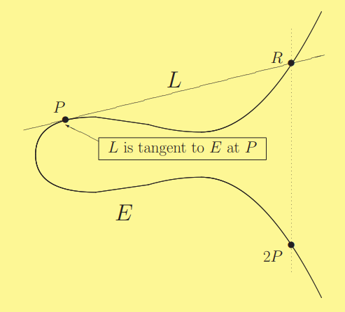

# An Introduction to Elliptic Curves

## An Introduction to Elliptic Curves

Elliptic Curves are curves of the form

$$
y^2=x^3+ax+b
$$

This is called a **Weierstrass equation**. The rational points on this elliptic curve miraculously create an **abelian group** under an operation called point addition.

## Point Addition

Given two points $$P$$ and $$Q$$, we can calculate a third point $$P \oplus Q$$ on the elliptic curve itself using a simple algorithm:


The images here are from **Joseph Silverman**'s presentation slides from 2006, which are an excellent reference and can be found [here](https://www.math.brown.edu/johsilve/Presentations/WyomingEllipticCurve.pdf).


.png>)

First, we draw the line $$L$$ through the points $$P$$ and $$Q$$, which intersects the curve at a third point $$R$$. We then draw a vertical line passing through $$R$$ which intersects the curve at a second point we call $$R^\prime$$. $$R^\prime$$ is the result of $$P \oplus Q$$, the point addition of $$P$$ and $$Q$$.

### Adding a Point to Itself

We can also add a point $$P$$ to itself, but how can we do that with infinitely many lines passing through? We simply take the tangent to the curve and find the point $$R$$ it intersects at before mirroring the point to $$R^\prime = 2P$$.

.png>)

### The Point at Infinity

Rarely, you may find yourself adding $$P$$ to $$-P$$, the point directly below $$P$$. In this case there is no third point of intersection and we say the result of point addition is $$\mathcal{O}$$, the point "at infinity".

#### Addition Rules
